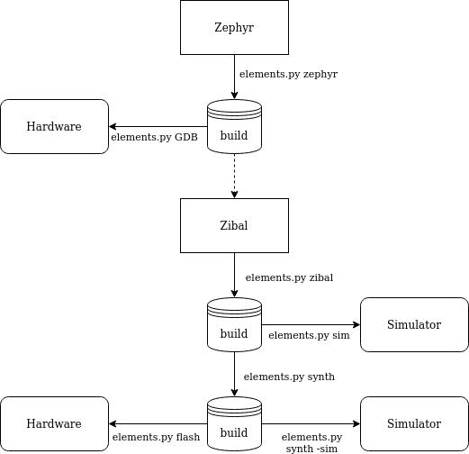

Elements SDK
============

The Elements Software Development Kit (SDK) is a bundle with various projects included to
build a complete Open Source Microcontroller Unit (MCU) and firmware. Moveover, it provides a
tool to easily generate all parts and helps to debug.

Prerequisites
#############

* Linux host system (Ubuntu 20.04 recommended)
* Python 3 (python3.8-dev)
* Vivado for Xilinx platforms (optional)

Installation
############

- Install required packages::

        sudo apt install ssh git repo libtool-bin autotools-dev automake pkg-config libyaml-dev
        sudo apt install python3 python3.8-dev pyhton3-pip virtualenv gdb
        sudo apt install iverilog gtkwave libcanberra-gtk-module libcanberra-gtk3-module
        sudo apt install libtinfo5 libncurses5

- Download the repository::

        git clone git@github.com:phytec-labs/elements-sdk.git
        cd elements-sdk/

- Download all projects::

        repo init -u git@github.com:phytec-labs/elements-manifest.git
        repo sync

- Create a virtualenv::

        virtualenv -p python3 venv
        . venv/bin/activate

- Install packages inside the virtualenv::

        pip3 install west
        pip3 install -r zephyr/scripts/requirements.txt

- Initialize Zephyr::

        west init -l zephyr
        west update

- Install the RISC-V toolchain::

        wget https://github.com/zephyrproject-rtos/sdk-ng/releases/download/v0.12.0/zephyr-toolchain-riscv64-0.12.0-x86_64-linux-setup.run
        chmod +x zephyr-toolchain-riscv64-0.12.0-x86_64-linux-setup.run
        ./zephyr-toolchain-riscv64-0.12.0-x86_64-linux-setup.run -- -d $PWD/zephyr-sdk-0.12.0 -y -nocmake

- Compile the VexRiscv OpenOCD fork::

        cd openocd
        ./bootstrap
        ./configure
        make -j8
        cd ../

Vivado
******

The Vivado toolchain is not part of this SDK and needs to be installed separatly for Xilinx
platforms from `Xilinx's homepage`. Download the Linux Self Extracting Web Installer for Version
2019.2 and install it. Ignore the warnings about the Not Supported Linux OS and do not install the
latest version. You can use the Vivado HL WebPACK license for free if you do not sell the bitsream
and disable everything except the Artix-7 Platform to save disk storage. Elements excepts to find
the Vivado toolchain under ``/opt/xilinx``.

.. code-block:: text

    chmod +x ~/Downloads/Xilinx_Unified_2019.2_1106_2127_Lin64.bin
    ~/Downloads/Xilinx_Unified_2019.2_1106_2127_Lin64.bin

.. _Xilinx's homepage: https://www.xilinx.com/support/download.html

Definitions
###########

This section shortly describes some definitions for clarification in the further documentation.

Application
***********

An application is the user-level software. It's build in the firmware and will be started by
Zephyr. Custom applications for boards will be added as application during the Zephyr compile
process.

SOC
***

A System on Chip (SOC) is the Microcontroller design. On FPGA based SOCs, the application is
added to the memory and deployed alongside the Verilog files.

Board
*****

A Board is a SOC with a specific pin-out. While the SOC only defines the in- and output-pins, a
boards maps these to physical IOs of a package.

Flows
#####

The SDK has some stages to generate a MCU and its firmware from sources. This section describes each stage and the flow between them.

Entry point for this flow is Zephyr. The compiled output will be stored in a build directoy and can
immediately used by GDB. The Zephyr output is a dependency for FPGA based designs and need to be
compiled before. The next stage generates the MCU files for the specific SOC and places these again
in the build storage. A simulator can than be used to run the design on the local machine without
any hardware. The last stage is the synthesizing of the design files into the specific hardware
architecture. The synthesized design can be simulated again or flashed to the hardware.

Usage
#####

The SDK flow can be used with the ``elements.py`` tool. The next chapters explain each stage of
the flow. However, the help text can also support with the built-in commands.

.. code-block:: text

    ./elements.py -h

Compile (Zephyr)
****************

The ``compile`` command compiles an application for a board. Both values must be passed as
mandatory argument. An optional flag ``-f`` can force to not use the build cache and compile
entirely new.

.. code-block:: text

    ./elements.py compile <board> <application> [-f]

Example to compile the LED demo for DH-006:

.. code-block:: text

    ./elements.py compile DH-006 zephyr-samples/demo/leds

Generate (Zibal)
****************

The ``generate`` command can build various different SOC designs. It only takes the name of the
SOC as parameter.

Hint: FPGA based SOC designs will add the compiled Zephyr output into the memory.

.. code-block:: text

    ./elements.py generate <soc>

Example to build the Hydrogen-1 SOC:

.. code-block:: text

    ./elements.py generate Hydrogen1

Simulation
----------

Since a board is always built on a specific SOC design, simulations can be done on board-level.
The ``simulate`` command takes as parameter the name of the board. The toolchain can be passed with
the optional parameter ``--toolchain``. The Xilinx toolchain is selected by default. A further
flag ``-synthesized`` can be used to simulate a synthesized design. This flag is currently only
available for the Xilinx toolchain.

.. code-block:: text

    ./elements.py simulate <board> [--toolchain <xilinx/oss>] [-synthesized]

Example to simulate DH-006:

.. code-block:: text

    ./elements.py simulate DH-006

Synthesize
----------

The synthesize is similiar to the simulation. It can synthesize a SOC design on board-level.

.. code-block:: text

    ./elements.py synthesize <board> [--toolchain <xilinx>]

Example to simulate DH-006:

.. code-block:: text

    ./elements.py synthesize DH-006

Flash
*****

This command flashes a bitsream directly into a FPGA or permantly into a SPI NOR. Alternatively,
it can also flash a firmware into the memory of the MCU. The FPGA destination is set by default.

.. code-block:: text

    ./elements.py flash <board> [--destination <fpga/spi/memory>]

Example to flash the FPGA:

.. code-block:: text

    ./elements.py flash DH-006

Debug
*****

The debug command supports debugging the firmware. It flashes a new firmware and opens a debugger
(GDB) before starting at start address.

.. code-block:: text

    ./elements.py debug

Example to flash the firmware into the memory and start at the start address:

.. code-block:: text

    ./elements.py debug

License
#######

Copyright (c) 2020 PHYTEC Messtechnik GmbH. Released under the `license`_.

.. _license: COPYING.MIT
