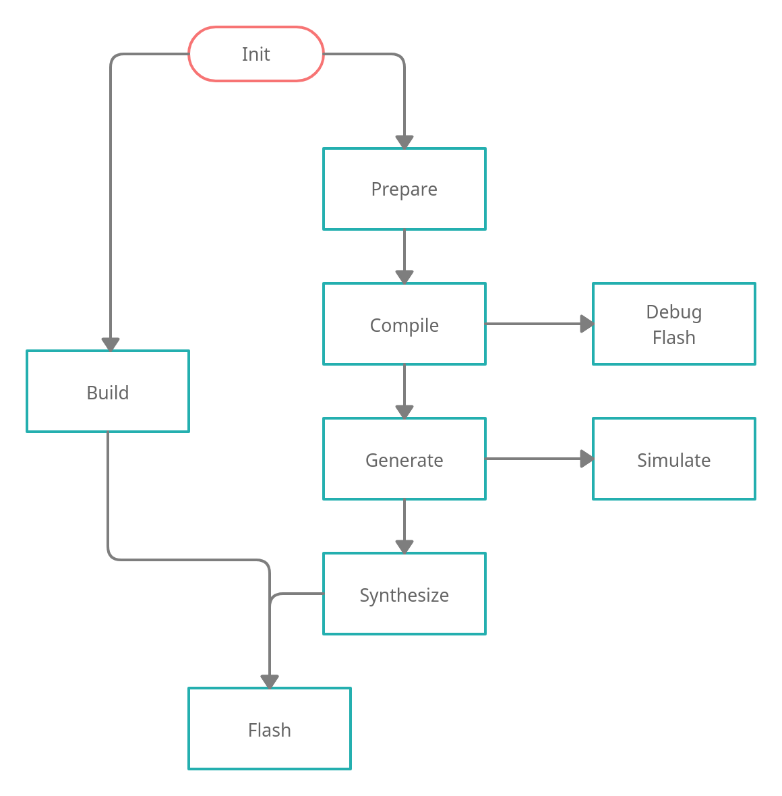

Elements SDK
============

The Elements Software Development Kit (SDK) is a bundle of various projects to develop, build and
debug all layers of an Open Source Microcontroller Unit (MCU). This means it includes System on
Chip (SOC) designs and the corresponding Operation Sytem (OS). Moreover, different tools and both
commerical and open source toolchains are added.

The most important part is a Python Command-line tool to easily generate custom MCUs and to support
debugging or deploying it.

The complete documentation is uploaded to `https://phytec-labs.github.io/elements-sdk/`_ or can be
build manually as described in `Documentation`_.

.. _https://phytec-labs.github.io/elements-sdk/: https://phytec-labs.github.io/elements-sdk/

.. inclusion-start-marker-do-not-remove

Features
########

* Open-Source FPGA flow
* Portfolio of configurable peripherals with OS support
* Predefined SOC platforms
* Integrated Operation Systems like Zephyr
* Toolchain files are generated automatically
* Nightly checks

Focus on defining a custom SOC and writing your applcation!

Prerequisites
#############

* Linux host system (Ubuntu 20.04 recommended)
* Python 3 (python3.8-dev)
* Vivado for Xilinx platforms (optional)
* Cadence for digital silicons (optional)

Installation
############

- Install required packages::

        sudo apt install ssh git libtool-bin autotools-dev automake pkg-config libyaml-dev
        sudo apt install python3 python3.8-dev python3-pip virtualenv gdb
        sudo apt install iverilog gtkwave libcanberra-gtk-module libcanberra-gtk3-module
        sudo apt install libtinfo5 libncurses5

- Download the repository and checkout the latest release::

        git clone https://github.com/phytec-labs/elements-sdk.git
        cd elements-sdk/
        git checkout v22.1

- Create a virtualenv::

        virtualenv -p python3 venv

- Initialise the SDK::

        python3 elements-fpga.py init

Vivado
******

The Vivado toolchain is not part of this SDK and needs to be installed separately for Xilinx
platforms from `Xilinx's homepage`_. Download the Linux Self Extracting Web Installer for Version
2020.2 and install it. Select Vivado as product and Vivado HL WebPACK as Edition. You can use this
edition's license for free, if you do not sell the bitsream, and disable everything except the
Artix-7 Platform to save disk storage. Elements excepts to find the Vivado toolchain under
``/opt/xilinx``.

.. code-block:: text

    chmod +x ~/Downloads/Xilinx_Unified_2020.2_1118_1232_Lin64.bin
    ~/Downloads/Xilinx_Unified_2020.2_1118_1232_Lin64.bin

.. _Xilinx's homepage: https://www.xilinx.com/support/download.html

Definitions
###########

This section shortly describes some definitions for clarification in the further documentation.

Application
***********

An application is the user-level software. It's build-in to the firmware and will be started by
Zephyr. Custom applications for boards will be added as application during the Zephyr compile
process.

SOC
***

A System on Chip (SOC) is a Microcontroller design. On FPGA based SOCs, an application might be
added to the memory and deployed alongside the Verilog files.

Board
*****

A Board is a SOC with a specific pin-out. While a SOC only defines the in- and output-pins, a board
maps these to physical IOs of a package.

Kit
***

A kit is a combination of a SOC and board. Since a SOC can be used in multiple boards, this unique
combination is very important.

FPGA Flow
#########

The SDK has some stages to generate a MCU and its firmware from sources. This section describes
each stage and the flow between them.

After the SDK was initialized, two pathes are possible. The shortest is to ``build`` a bitstream,
which can be flashed to a FPGA board directly. Otherwise, a step-by-step path allows to check and
debug. First, ``prepare`` necessary files for the toolchains. Secondly, ``compile`` the firmware
with an given application. Either ``debug`` or ``flash`` it to a running design or ``generate``
the SOC design. Afterwards, it's possible to ``simulate`` the design or ``synthesize`` the
bitstream. Lastly, ``flash`` the generated bitstream to a FPGA board.

Usage
*****

The SDK flow can be used with the ``elements-fpga.py`` tool. This chapters explains each stage of
the flow. However, the help text can also support with the built-in commands.

.. code-block:: text

    ./elements-fpga.py -h

SOCs
----

The ``socs`` command lists all available SOCs.

.. code-block:: text

    ./elements-fpga.py socs

Boards
------

The ``boards`` command lists all available boards for a SOC.

.. code-block:: text

    ./elements-fpga.py boards <soc>

Prepare
-------

The ``prepare`` command creates data for a kit which are required by the following commands.

.. code-block:: text

    ./elements-fpga.py compile <soc> <board>

Example to prepare a kit with a Hydrogen1 SOC for the Nexys4-DDR board:

.. code-block:: text

    ./elements-fpga.py prepare Hydrogen1 Nexys4-DDR

Compile (Zephyr)
----------------

The ``compile`` command compiles an application for a board. Both values must be passed as
mandatory argument. An optional flag ``-f`` can force to not use the build cache and compile
entirely new.

.. code-block:: text

    ./elements-fpga.py compile <soc> <board> zephyr <application> [-f]

Example to compile the LED demo for a kit with the Hydrogen1 SOC and the Nexys4-DDR board:

.. code-block:: text

    ./elements-fpga.py compile Hydrogen1 Nexys4-DDR zephyr-samples/demo/leds

Generate (Zibal)
----------------

The ``generate`` command can build a SOC designs for a kit. Moreover, it will create files for
the toolchains.

.. tip::

  FPGA based SOC designs will add the compiled Zephyr binary into the memory.

.. code-block:: text

    ./elements-fpga.py generate <soc> <board>

Example to build the Hydrogen1 SOC for a kit with the Nexys4-DDR board.

.. code-block:: text

    ./elements-fpga.py generate Hydrogen1 Nexys4-DDR

Simulate
--------

The ``simulate`` command can simulate a kit. The toolchain can be passed with the optional
parameter ``--toolchain``. The Open-Source toolchain is selected by default. A further
option can select the source type to simulate for example a synthesized design.

.. code-block:: text

    ./elements-fpga.py simulate <soc> <board> [--toolchain <oss/cadence>]
                           [--source <generated/synthesized/placed>]

Example to simulate a kit with the Hydrogen1 SOC and the Nexys4-DDR board:

.. code-block:: text

    ./elements-fpga.py simulate Hydrogen1 Nexys4-DDR

Synthesize
----------

The ``synthesize`` is similiar to the simulate. It can synthesize a SOC design for a board.

.. code-block:: text

    ./elements-fpga.py synthesize <soc> <board> [--toolchain <xilinx/oss>]

Example to synthesize a kit with the Hydrogen1 SOC and the Nexys4-DDR board:

.. code-block:: text

    ./elements-fpga.py synthesize Hydrogen1 Nexys4-DDR --toolchain oss

Build
-----

Sometimes only the bitsream is required and to not run all steps, the ``build`` command can
prepare, compile, generate and synthesize a design. It requires an application if the board
requests one.

.. code-block:: text

    ./elements-fpga.py build <soc> <board> [<application>]

Example to build a kit with the Hydrogen1 SOC and the Nexys4-DDR board:

.. code-block:: text

    ./elements-fpga.py build Hydrogen1 Nexys4-DDR zephyr-samples/startup/mtimer/ --toolchain oss

Flash
-----

This command flashes a bitsream directly into a FPGA or permantly into a SPI NOR. Alternatively,
it can also flash a firmware into the memory of the MCU. The FPGA destination is set by default.

.. code-block:: text

    ./elements-fpga.py flash <soc> <board> [--destination <fpga/spi/memory>]

Example to flash the FPGA on a kit with the Hydrogen1 SOC and the Nexys4-DDR board:

.. code-block:: text

    ./elements-fpga.py flash Hydrogen1 Nexys4-DDR

Debug
-----

The debug command supports debugging the firmware. It flashes a new firmware and opens a debugger
(GDB) before starting at start address.

.. code-block:: text

    ./elements-fpga.py debug <soc> <board>

Example to flash the firmware into the memory and start at the start address:

.. code-block:: text

    ./elements-fpga.py debug Hydrogen1 Nexys4-DDR

Test
----

Applications can be simulated on a kit to verify the hard- and software of peripherals works as
expected by checking against predefined test cases.

.. code-block:: text

    ./elements-fpga.py test <soc> <board> <testcase>

Example to test the mtimer startup application for the Hydrogen1 SOC and the Nexys4-DDR board:

.. code-block:: text

    ./elements-fpga.py test Hydrogen1 Nexys4-DDR mtimer

Benchmark
---------

This command provides speed and size information about a kit. These data are useful to compare
different kind of kits among each other.

.. code-block:: text

    ./elements-fpga.py benchmark <soc> <board>

Example to generate speed and size information for the Hydrogen1 SOC and the Nexys4-DDR board:

.. code-block:: text

    ./elements-fpga.py benchmark Hydrogen1 Nexys4-DDR

Docker
######

A Dockerfile is provided for systems which do not run with the recommended versions. The Docker
will have included all required packages for the SDK.

.. code-block:: text

    sudo docker build -t elements-sdk:1.0 .
    sudo docker run elements-sdk:1.0 \
        ./elements-fpga.py compile Hydrogen1 Nexys4-DDR zephyr zephyr-samples/demo/leds

.. tip::

  Only ``compile`` and ``generate`` are currently supported.

.. inclusion-end-marker-do-not-remove

Documentation
#############

The documentation can easily build with Sphinx. Therefore, run the Makefile inside the docsource
folder.

.. code-block:: text

    source venv/bin/activate
    make clean html -C docsource
    firefox docsource/build/html/index.html

License
#######

Copyright (c) 2021 PHYTEC Messtechnik GmbH. Released under the `MIT license`_.

.. _MIT license: COPYING.MIT
