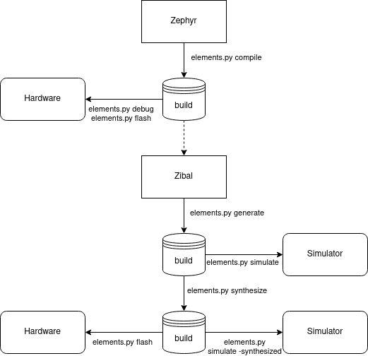

Elements SDK
============

The Elements Software Development Kit (SDK) is a bundle with various projects included to
build a complete Open Source Microcontroller Unit (MCU) and firmware. Moveover, it provides a
tool to easily generate all parts and helps to debug.

Prerequisites
#############

* Linux host system (Ubuntu 18.04 recommended)
* Python 3 (python3.8-dev)
* Vivado for Xilinx platforms (optional)

Installation
############

- Install required packages::

        sudo apt install ssh git repo libtool-bin autotools-dev automake pkg-config libyaml-dev
        sudo apt install python3 python3.8-dev pyhton3-pip virtualenv gdb
        sudo apt install iverilog gtkwave libcanberra-gtk-module libcanberra-gtk3-module

- Download the repository::

        git clone git@github.com:phytec-labs/elements-sdk.git
        cd elements-sdk/

- Download all projects::

        repo init -u git@github.com:phytec-labs/elements-manifest.git
        repo sync

- Create a virtualenv::

        virtualenv -p python3 venv
        . venv/bin/activate

- Install packages inside the virtualenv::

        pip3 install west
        pip3 install -r zephyr/scripts/requirements.txt

- Initialize Zephyr::

        west init -l zephyr
        west update

- Install the RISC-V toolchain::

        wget https://github.com/zephyrproject-rtos/sdk-ng/releases/download/v0.11.4/zephyr-toolchain-riscv64-0.11.4-setup.run
        chmod +x zephyr-toolchain-riscv64-0.11.4-setup.run
        ./zephyr-toolchain-riscv64-0.11.4-setup.run -- -d $PWD/zephyr-sdk-0.11.4 -y

- Compile the VexRiscv OpenOCD fork::

        cd openocd
        ./bootstrap
        ./configure
        make -j8
        sudo make install
        cd ../

Vivado
******

The Vivado toolchain is not part of this SDK and needs to be installed separatly for Xilinx
platforms from `Xilinx's homepage`. Download the Linux Self Extracting Web Installer for Version
2020.1 and install it. You can disable everything except the Artix-7 Platform to save disk storage.
Elements excepts to find the Vivado toolchain under ``/opt/xilinx/Vivado/``.

.. _Xilinx's homepage: https://www.xilinx.com/support/download.html

Definitions
###########

This section shortly describes some definitions for clarification in the further documentation.

Application
***********

An application is the user-level software. It's build in the firmware and will be started by
Zephyr. Custom applications for boards will be added as application during the Zyphr compile
process.

SOC
***

A System on Chip (SOC) is the Microcontroller design. On FPGA based SOCs, the application is
added to the memory and deployed alongside the Verilog files.

Board
*****

A Board is a SOC with a specific pin-out. While the SOC only defines the in- and output-pins, a
boards maps these to physical IOs of a package.

Flows
#####

The SDK has some stages to generate a MCU and its firmware from sources. This section describes each stage and the flow between them.

Entry point for this flow is Zephyr. The compiled output will be stored in a build directoy and can
immediately used by GDB. The Zephyr output is a dependency for FPGA based designs can need to be
run before. The next stage generates the MCU files for the specific SOC and places these again in
the build storage. A simulator can than be used to run the design on the local machine without any
hardware. The last stage is the synthesizing of the design files into the specific hardware
architecture. The synthesized design can be simulated again or flashed to the hardware.

Usage
#####

The SDK flow can be used with the ``elements.py`` tool. The next chapters explain each stage of
the flow. However, the help text can also support with the built-in commands.

.. code-block:: text

    . venv/bin/activate
    python elements.py -h

You can leave the virtualenv by running ``deactivate`` in the bash. Do not forget to source the
virtualenv next time you want to use ``elements.py`` in a new shell session.

Zephyr
******

The ``zephyr`` command can compile an application for a board. Both values must be passed as
mandatory argument. An optional flag ``-f`` can force to not use the build cache and compile
entirely new.

.. code-block:: text

    python elements.py zephyr <board> <application> [-f]

Example to compile the LED demo for TH-283:

.. code-block:: text

    python3 lements.py zephyr TH-283 zephyr-samples/demo/leds

Zibal
*****

The ``zibal`` command can build various different SOC designs. It only takes the name of the
SOC as parameter.

Hint: FPGA based SOC designs will add the compiled Zephyr output into the memory.

.. code-block:: text

    python elements.py zibal <soc>

Example to build the Hydrogen-1 SOC:

.. code-block:: text

    python elements.py zibal Hydrogen1

Simulation
----------

Since a board is always built on a specific SOC design, simulations can be done on board-level.
The ``sim`` command takes as parameter the name of the board. The toolchain can be passed with
the optional parameter ``--toolchain``. The Xilinx toolchain is selected by default. A further
flag ``-synthesized`` can be used to simulate a synthesized design. This flag is currently only
available for the Xilinx toolchain.

.. code-block:: text

    python elements.py simulate <board> [--toolchain <xilinx>] [-synthesized]

Example to simulate TH-283:

.. code-block:: text

    python elements.py simulate TH-283

Synthesize
----------

The synthesize is similiar to the simulation. It can synthesize a SOC design on board-level.
the synthesized design.

.. code-block:: text

    python elements.py synthesize <board> [--toolchain <xilinx>]

Example to simulate TH-283:

.. code-block:: text

    python elements.py synthesize TH-283

Flash
*****

This command flashes a bitsream directly into a FPGA or permantly into a SPI NOR. The FPGA
destination is set by default.

.. code-block:: text

    python elements.py flash <board> [--destination <fpga/spi>]

Example to flash the FPGA:

.. code-block:: text

    python elements.py flash TH-283

GDB
***

The GDB command supports debugging the firmware. It can flash a new firmware and either start at
start address or open a debugging before starting.

.. code-block:: text

    python elements.py GDB <flash/debug>

Example to flash the firmware into the memory and start at the start address:

.. code-block:: text

    python elements.py GDB flash

License
#######

Copyright (c) 2020 PHYTEC Messtechnik GmbH. Released under the `license`_.

.. _license: COPYING.MIT
