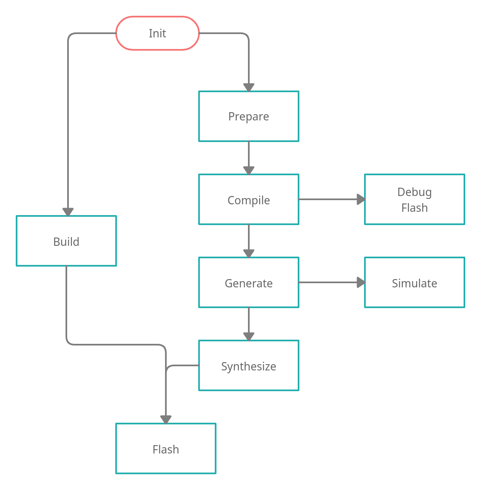

General Tasks
#############

For common tasks a dedicated tool exists called ``elements.py``. This can be used to initialize or
clean the project or to get information about available SOCs or boards.

Checkout
--------

The ``checkout`` command checks out all repositories from either the default release manifest
or a custom file given with the ``--manifest`` parameter.

.. code-block:: text

    ./elements.py checkout [--manifest next.xml] [-f]

Init
----

The ``init`` command downloads all repositories or toolchains and compiles required binaries. By
default the current release manifest will be used. Another manifest can be passed as argument with
the ``--manifest`` parameter. To re-initialize the project, the parameter ``-f`` can force to
initialize.

.. code-block:: text

    ./elements.py init [--manifest next.xml] [-f]

Clean
-----

The ``clean`` command can remove all build artifacts for a kit, soc or the entire build.

.. code-block:: text

    ./elements.py clean [<soc> [<board>]]

SOCs
----

The ``socs`` command lists all available SOCs.

.. code-block:: text

    ./elements.py socs

Boards
------

The ``boards`` command lists all available boards for a SOC.

.. code-block:: text

    ./elements.py boards <soc>

FPGA Flow
#########

The SDK has some stages to generate a MCU and its firmware from sources. This section describes
each stage and the flow between them.

After the SDK was initialized, two pathes are possible. The shortest is to ``build`` a bitstream,
which can be flashed to a FPGA board directly. Otherwise, a step-by-step path allows to check and
debug. First, ``prepare`` necessary files for the toolchains. Secondly, ``compile`` the firmware
with an given application. Either ``debug`` or ``flash`` it to a running design or ``generate``
the SOC design. Afterwards, it's possible to ``simulate`` the design or ``synthesize`` the
bitstream. Lastly, ``flash`` the generated bitstream to a FPGA board.

The SDK flow can be used with the ``elements-fpga.py`` tool. This chapters explains each stage of
the flow. However, the help text can also support with the built-in commands.

.. code-block:: text

    ./elements-fpga.py -h

Prepare
-------

The ``prepare`` command creates data for a kit which are required by the following commands.

.. code-block:: text

    ./elements-fpga.py <soc> <board> prepare

Example to prepare a kit with a Hydrogen1 SOC for the Nexys4-DDR board:

.. code-block:: text

    ./elements-fpga.py Hydrogen1 Nexys4-DDR prepare

Compile
-------

The ``compile`` command compiles one or more firmwares for a board. It takes all information
from data which are generated during the ``prepare`` stage. Be default, this command compiles
all firmwares. Otherwise, only one ``storage`` can be compiled by passing the storage name.
Moreover, for Zephyr firmwares, the storage parameter can be extended with an optional
``application`` parameter to define the path to a custom application. Lastly, the optional
flag ``-f`` can force to not use the build cache and compile entirely new.

.. code-block:: text

    ./elements-fpga.py <soc> <board> compile [storage] [application] [-f]

Example to compile the LED demo for a kit with the Hydrogen1 SOC and the Nexys4-DDR board:

.. code-block:: text

    ./elements-fpga.py Hydrogen1 Nexys4-DDR compile zephyr0 internal/zephyr-samples/demo/leds

Generate
--------

The ``generate`` command creates SOC designs for the given kit.

.. tip::

  FPGA based SOC designs will add the compiled Zephyr binary into the memory.

.. code-block:: text

    ./elements-fpga.py <soc> <board> generate

Example to build the Hydrogen1 SOC for a kit with the Nexys4-DDR board.

.. code-block:: text

    ./elements-fpga.py Hydrogen1 Nexys4-DDR generate

Simulate
--------

The ``simulate`` command can simulate a kit. The toolchain can be passed with the optional
parameter ``--toolchain``. The Open-Source toolchain is selected by default. A further
option can select the source type to simulate for example a synthesized design.

.. code-block:: text

    ./elements-fpga.py <soc> <board> simulate

Example to simulate a kit with the Hydrogen1 SOC and the Nexys4-DDR board:

.. code-block:: text

    ./elements-fpga.py Hydrogen1 Nexys4-DDR simulate

Synthesize
----------

The ``synthesize`` is similiar to the simulate. It can synthesize a SOC design for a board.

.. code-block:: text

    ./elements-fpga.py <soc> <board> synthesize [--toolchain <xilinx/symbiflow>]

Example to synthesize a kit with the Hydrogen1 SOC and the Nexys4-DDR board:

.. code-block:: text

    ./elements-fpga.py Hydrogen1 Nexys4-DDR synthesize --toolchain symbiflow

Build
-----

Sometimes only the bitsream is required and to not run all steps, the ``build`` command can
prepare, compile, generate and synthesize a design. It requires an application if the board
requests one.

.. code-block:: text

    ./elements-fpga.py <soc> <board> build [<application>]

Example to build a kit with the Hydrogen1 SOC and the Nexys4-DDR board:

.. code-block:: text

    ./elements-fpga.py Hydrogen1 Nexys4-DDR build zephyr-samples/startup/mtimer/ \
        --toolchain symbiflow

Flash
-----

This command flashes a bitsream directly into a FPGA or permantly into a SPI NOR. Alternatively,
it can also flash a firmware into the memory of the MCU. The FPGA destination is set by default.

.. code-block:: text

    ./elements-fpga.py <soc> <board> flash [--destination <fpga/spi/memory>]

Example to flash the FPGA on a kit with the Hydrogen1 SOC and the Nexys4-DDR board:

.. code-block:: text

    ./elements-fpga.py Hydrogen1 Nexys4-DDR flash

Debug
-----

The debug command supports debugging the firmware. It flashes a new firmware and opens a debugger
(GDB) before starting at start address.

.. code-block:: text

    ./elements-fpga.py <soc> <board> debug

Example to flash the firmware into the memory and start at the start address:

.. code-block:: text

    ./elements-fpga.py Hydrogen1 Nexys4-DDR debug

Test
----

Applications can be simulated on a kit to verify the hard- and software of peripherals works as
expected by checking against predefined test cases.

.. code-block:: text

    ./elements-fpga.py <soc> <board> <testcase> test

Example to test the mtimer startup application for the Hydrogen1 SOC and the Nexys4-DDR board:

.. code-block:: text

    ./elements-fpga.py Hydrogen1 Nexys4-DDR mtimer test

Benchmark
---------

This command provides speed and size information about a kit. These data are useful to compare
different kind of kits among each other.

.. code-block:: text

    ./elements-fpga.py <soc> <board> benchmark

Example to generate speed and size information for the Hydrogen1 SOC and the Nexys4-DDR board:

.. code-block:: text

    ./elements-fpga.py Hydrogen1 Nexys4-DDR benchmark

.. note::

  This command is only available in release v22.2 or later.

ASIC Flow
#########

TBD.
